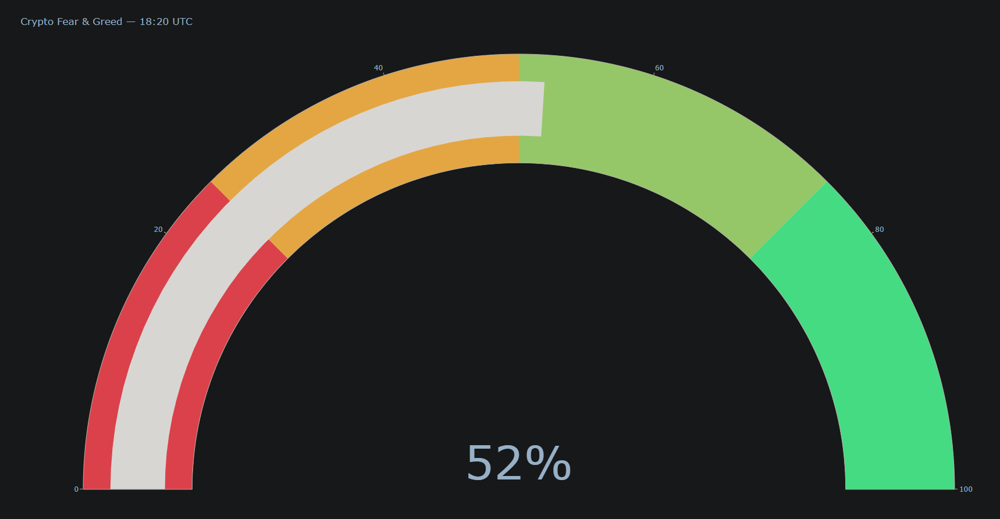

# 📊 Real-Time Crypto Fear & Greed Index (Python, 100 LOC)

A **live sentiment dashboard** for the crypto market that updates every minute, scrapes public data only, and needs **zero paid API keys**.



---

## ✨  Features
| ✅ | Description |
|----|-------------|
| **No API keys** | Pulls data from Reddit’s free JSON endpoint and X/Twitter via Nitter HTML. |
| **< 100 lines** | Entire logic in a single `crypto_fear_greed.py` script. |
| **Hybrid sentiment** | Combines VADER (text) and emoji heuristics (🚀 vs 💀). |
| **Plotly gauge** | Beautiful semi-circle gauge with green-to-red color bands. |
| **1-minute refresh** | Loop prints the latest score and redraws automatically. |
| **Easy to extend** | Plug-in Google Trends, Binance order-books, Telegram alerts, etc. |

---

## 🔥 Quick Start

```bash
# install deps
pip install requests nltk plotly  

